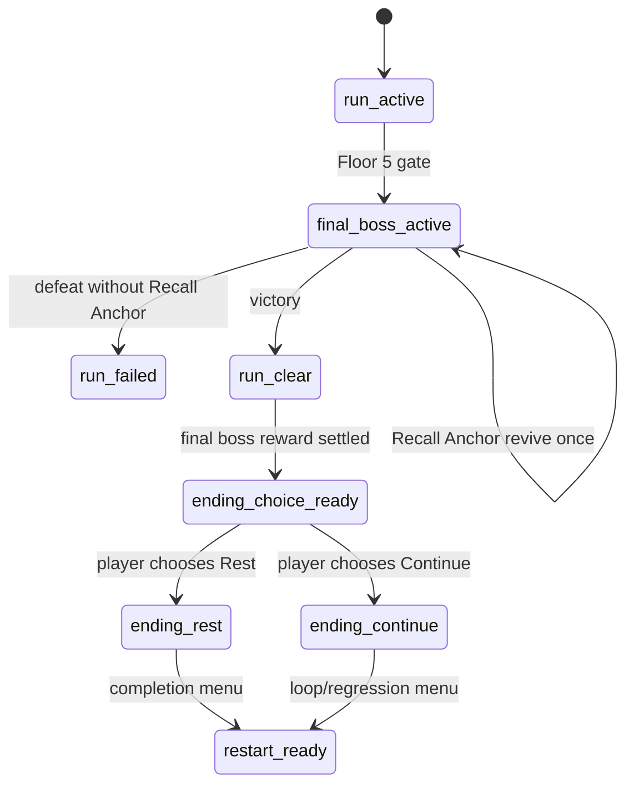

# Ending Choice Spec v0.1

## Scope

- Baseline: GDD D-013 and `origin/Proto` `d94697f`.
- Purpose: define functional Rest / Continue ending differences without writing final ending prose.
- Unity execution: none.
- Runtime/SO edits: none.

## D-013 Constraint

| Locked design | Implementation implication |
|---|---|
| Final boss defeated. | Ending choice must not appear before final boss victory. |
| Rest item obtained. | The victory result should set an ending-choice-ready condition or inventory/state marker. Exact item stableId is not implemented yet. |
| Player chooses Rest or Continue. | Choice must produce two distinct public states: `ending.rest` and `ending.continue`. |
| Both are forms of forgetting. | Do not label either branch as simple good/bad. |

## Proposed State Flow

## Public State IDs

| State id | Meaning | Entered from | Exits to | Notes |
|---|---|---|---|---|
| `run.clear` | Final boss/run clear result is stable. | Final boss victory. | `ending.choice.ready`. | Existing `run.clear` for Floor 2 demo must remain supported; full completion uses the same state after Floor 5. |
| `ending.choice.ready` | Ending choice UI can render. | `run.clear` plus final boss reward/state marker. | `ending.rest` or `ending.continue`. | No final text; placeholder keys only. |
| `ending.rest` | Rest ending selected. | Ending choice. | `run.restartReady` or completion menu. | Terminal ending branch. |
| `ending.continue` | Continue ending selected. | Ending choice. | `run.restartReady` or next loop start. | Loop-preserving branch. |

## Functional Difference

| Area | `ending.rest` | `ending.continue` |
|---|---|---|
| Narrative role | Active release/forgetting. | Ongoing loop/forgetting by repetition. |
| Runtime result | Terminal completion branch. | Completion branch that allows loop continuation framing. |
| Memory/reflection | Preserve unlocked memory/reflection for gallery/debug review. | Preserve unlocked memory/reflection and seed next run context. |
| NPC stage | S5 branch state. | S5 branch state or loop-return state. |
| Restart affordance | Manual restart/completion menu after branch is acknowledged. | Manual restart or next run affordance after branch is acknowledged. |
| Rewards | No extra combat reward beyond final boss settlement unless design approves. | No extra combat reward beyond final boss settlement unless design approves. |
| Copy ownership | Writer-owned. | Writer-owned. |

## Placeholder Key Map

| UI/event | Placeholder key |
|---|---|
| Ending choice title | `TEXT_ENDING_CHOICE_TITLE_PLACEHOLDER` |
| Rest choice label | `TEXT_ENDING_REST_CHOICE_PLACEHOLDER` |
| Continue choice label | `TEXT_ENDING_CONTINUE_CHOICE_PLACEHOLDER` |
| Rest branch result title | `TEXT_ENDING_REST_RESULT_TITLE_PLACEHOLDER` |
| Continue branch result title | `TEXT_ENDING_CONTINUE_RESULT_TITLE_PLACEHOLDER` |
| Rest branch body | `TEXT_ENDING_REST_BODY_WRITER_REQUIRED` |
| Continue branch body | `TEXT_ENDING_CONTINUE_BODY_WRITER_REQUIRED` |
| Rest NPC reaction | `NPC_REACT_ENDING_REST_PLACEHOLDER` |
| Continue NPC reaction | `NPC_REACT_ENDING_CONTINUE_PLACEHOLDER` |
| Ending choice cutscene cue | `CUTSCENE_ENDING_CHOICE_PLACEHOLDER` |
| Rest branch cutscene cue | `CUTSCENE_ENDING_REST_PLACEHOLDER` |
| Continue branch cutscene cue | `CUTSCENE_ENDING_CONTINUE_PLACEHOLDER` |

## QA Criteria

| ID | Criteria |
|---|---|
| END-QA-01 | Ending choice cannot appear unless final boss victory has reached stable `run.clear`. |
| END-QA-02 | `run.failed` never opens ending choice. |
| END-QA-03 | Recall Anchor intervention keeps combat active and does not open ending choice. |
| END-QA-04 | Selecting Rest creates `ending.rest`, not `run.clear` only. |
| END-QA-05 | Selecting Continue creates `ending.continue`, not an immediate silent restart. |
| END-QA-06 | Rest and Continue each save their branch result exactly once. |
| END-QA-07 | Reopening/refreshing HUD cannot duplicate final boss reward, ending branch save, reflection, or cutscene trigger. |
| END-QA-08 | Raw debug tokens remain hidden in default presentation mode; public labels may resolve from placeholder keys. |
| END-QA-09 | No final NPC line, memory truth, or ending prose is present before writer approval. |
| END-QA-10 | The two branches are functionally distinct in state and QA, even if final prose is still placeholder. |

## Open Decisions to Carry

| Decision | Owner | Needed before implementation? |
|---|---|---|
| Exact stableId for the Rest item/reward marker | design/dev | Yes |
| Whether Continue immediately starts a new run or shows a branch result first | writer/dev | Yes |
| Whether ending branch unlocks gallery/credits/recording screen | dev/design | P1 |
| Final branch text and NPC reaction prose | writer | Yes, before public build |
